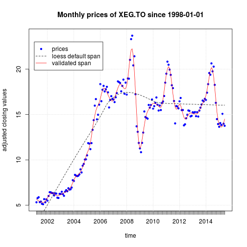

## Prompt
The R standard library @theRlang provides a method for fitting
kernel-based local polynomial regression called `loess{stats}`.
All kernel methods involve a tuning parameter $\lambda$ that,
roughly speaking, controls the amount of averaging of observations for each prediction point
(see for instance page 194ff of @elemstatslearn).
In `loess{stats}` this parameter is called `span` and has default value $0.75$;
however, it is better to deduce the best setting for `span` from the data itself.
Our R function `hp_loess` below accomplishes this by using _repeated
training/test splits_ which is a form of cross-validation different from the k-fold method
(see for instance pages 71ff of @appliedpred).
For each candidate value of the `span`, we perform the following step ten times:
We choose 80% of the  observations randomly
uniformly without replacement as the _training set_, and use the remaining 20%
as the _test set_; `loess` is fitted to the training set with the candidate `span` value,
and the corresponding prediction error on the test set is recorded.
The `span` value with the smallest average prediction error is chosen as the `best_span`. 

```r
require (formula.tools)
hp_loess <- function (frm, dat=data.frame(), span_low = 0.75/9, span_high=0.75*9, nl = 10) {  
  
  lambs = sapply (0:(nl-1), function (i) {span_low * (span_high/span_low)^(i/(nl-1))})
  
  m = dim(dat)[1]
  cv.size = as.integer (m / 5)
  B = 10
  
  errs = matrix (rep (0.0, nl*B), nrow=nl)
  for (i in 1:nl) {
    for (b in 1:B) {
      tmp = sample.int (n=m, size=m, replace=F)
      cv.ind = tmp[1:cv.size]
      tr.ind = tmp[(cv.size+1):m]
      tr.dat = dat [tr.ind, ]
      cv.dat = dat [cv.ind, ]
      
      md = loess (frm, data=tr.dat, span=lambs[i],
                  control=loess.control (surface="direct"))
      
      prd = predict (md, newdata=cv.dat)
      
      if (sum (is.na (prd)) > 0) {
        stop()
      }
      
      errs [i, b] = sum ((prd - cv.dat[, as.character (lhs (frm))])^2)
    }
  }
  
  m.errs = apply (errs, 1, mean)
  s.errs = apply (errs, 1, sd) / sqrt(B)
  
  ind = which.min (m.errs)
  best_lambda = lambs [ind]
  
  
  res = loess (frm, data=dat, span=best_lambda,
               control=loess.control (surface="direct"))
  
  res$lambs = lambs
  res$best_span = best_lambda
  res$cv.errs = m.errs
  res$cv.stderrs = s.errs
  res
}
```

# Example
We can now test our `hp_loess` function on real data. 
We use the monthly adjusted closing prices from 1998-01-01 to 2015-06-04
of the S&P/TSX Capped Energy Index Fund (ticker symbol XEG.TO) 
that we obtain from [Yahoo Finance Canada](https://ca.finance.yahoo.com/)
using the quantmod @quantmod package.
In the figure following the R code fragment, the black dashed line is the `loess` fit
with the default span, and the red line results from setting the span by
our code above. We see that validated `span` setting clearly identifies
the general trend of the data, whereas the default value results
in an overly smoothed fit.


```r
rm (list = ls())

source ("./hp_loess.R")
library (quantmod)
set.seed (8353)
ticker <- "XEG.TO"
description <- "S&P/TSX Capped Energy Index Fund that gives exposure to Canada's energy sector."
d <- getSymbols (ticker, src = "yahoo", from = "1998-01-01", to = "2015-06-04",
				auto.assign = FALSE)

d <- to.monthly (d)
d <- Ad (d)
the_months <- index (d)
price <- coredata (d)
colnames (price) <- NULL

plot (the_months, price, pch=20, col='blue',
xlab="time", ylab="adjusted closing values", main="Monthly prices of XEG.TO since 1998-01-01"); grid()
df <- data.frame (t=c(1:length(the_months)), p=price)

default.span <- loess (p~t, data=df, control=loess.control (surface="direct"))
lines (the_months, default.span$fitted, col='black', lty=2)

ptm <- proc.time()
good.span <- hp_loess (p~t, dat=df, span_low = 0.75/9, span_high=0.75*9)
ptm <- proc.time() - ptm
lines (the_months, good.span$fitted, col='red')
legend (x=2001, y= 23, c("prices", "loess default span", "validated span"),
lty =c (NA,2,1), 
col= c('blue', 'black', 'red'),
pch= c(20, NA, NA))
```

 
